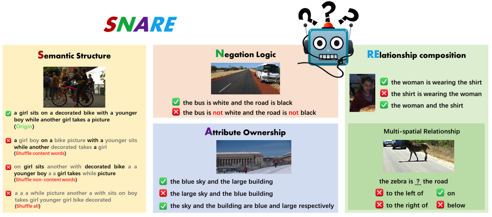

# SNARE (a multimodal alignment probing benchmark)
Project for our work "[<b>Can Linguistic Knowledge Improve Multimodal Alignment in Vision-Language Pre-training?</b>](https://arxiv.org/abs/2308.12898)", which is the <b>first large-scale multimodal alignment probing benchmark</b>, to detect the vital linguistic components in the vision-language pretrained models.

SNARE contains four tasks: 1) semantic structure, 2) negation logic, 3) attribute ownership, and 4) relationship composition.  



## Abstract
The multimedia community has shown a significant interest in perceiving and representing the physical world with multimodal pretrained neural network models, and among them, the visual-language pertaining (VLP) is, currently, the most captivating topic. The common practice for pretraining the visual-language backbone is supervising the training process with paired image-text data. However, there have been few endeavors dedicated to the exploration of 1) whether essential linguistic knowledge (e.g., semantics and syntax) can be extracted during VLP, and 2) how such linguistic knowledge impact or enhance the multimodal alignment. In response, here we aim to elucidate the impact of comprehensive linguistic knowledge, including semantic expression and syntactic structure, on multimodal alignment. Specifically, we design and release the SNARE, the first large-scale multimodal alignment probing benchmark, to detect the vital linguistic components, e.g., lexical, semantic, and syntax knowledge, containing four tasks: Semantic structure, Negation logic, Attribute ownership, and Relationship composition. Based on our proposed probing benchmark, our holistic analyses of five advanced VLP models (i.e., BLIP, CLIP, Flava, X-VLM, and BLIP2) illustrate that the VLP model: <i>i)</i> shows insensitivity towards complex syntax structures and relies on content words for sentence comprehension; <i>ii)</i> demonstrates limited comprehension of combinations between sentences and negations; <i>iii)</i> faces challenges in determining the presence of actions or spatial relationships within visual information and struggles with verifying the correctness of triple combinations. Given the above findings, we suggest that, to improve the multimodal alignment, 1) using the large generative language model as the language backbone in VLP to understand complex sentences; 2) establishing high-quality datasets by highlighting the content words and using simple syntax (e.g., short-distance semantic composition) to improve multimodal alignment; and 3) incorporating more fine-grained visual knowledge (e.g., spatial relationships) into pretraining objectives.

## Usage
We provide the code for evaluating the five models discussed in the paper on our benchmark. 

* The usage instructions of Python are as follows.
```python
from torch.utils.data import DataLoader
from snare.models import get_model
from snare.datasets_zoo import get_dataset
from snare import _default_collate

# Load the model. MODEL_NAME: "blip", "clip", "flava", "xvlm", "blip2" 
model, image_preprocess = get_model("MODEL_NAME", DEVICE, root_dir="weight_PATH")

# Load datas. DATASET_NAME: ["Attribute_Ownership", "Relationship_Composition", "Spatial_Relationship", "Negation_Logic", "COCO_Semantic_Structure", "Flickr30k_Semantic_Structure"]
dataset = get_dataset(DATASET_NAME, image_preprocess=image_preprocess, download=True)

# For models without an image preprocessing step, we offer a simple image preprocessing method.
collate_fn = _default_collate if image_preprocess is None else None

# Create DataLoader
joint_loader = DataLoader(dataset, batch_size=BATCH_SIZE, shuffle=False, num_workers=NUM_WORKERS, collate_fn=collate_fn)

# Retrieval scores between the image and texts 
retrieval_scores = model.get_retrieval_scores_batched(joint_loader)

# Calculate Acc score
if args.model_name in ['blip2']:
    scores = dataset.evaluate_vllm_scores(retrieval_scores)
else:
    scores = dataset.evaluate_scores(retrieval_scores)
```

* We also provide simpler executable Python files -- [SNARE_probing.py](SNARE_probing.py). Here's an example:
```bash
python SNARE_probing.py --device cuda:1 --dataset Attribute_Ownership --model_name flava
```

* The data format for each of our datasets is as follows, and you can write code on your own to utilize the dataset.
```python
item = {"image_options": [image], "caption_options": [Option_sentence_1, Option_sentence_2, ...]}
```


## Data Processing
 We performed secondary innovation on the original dataset to generate new data. If you wish to explore additional diverse options, you can refer to the code in `sanre/datasets_zoo/data_des.py`.

## Models 
We evaluate with five models and you can get the model weights from the following. Please see `sanre/models/` folder for more details. 

Model Name | Model File in this Repo | Repo |
| ---| --- | --- |
BLIP | [BLIP implementation](.snare\models\blip_load.py) | https://github.com/salesforce/BLIP |
CLIP | [CLIP implementation](.snare\models\clip_load.py) | https://github.com/openai/CLIP |
Flava | [Flava implementation](.snare\models\flava_load.py) | https://huggingface.co/facebook/flava-full |
XVLM | [XVLM implementation](.snare\models\xvlm_load.py) | https://github.com/zengyan-97/X-VLM |
BLIP2 | [BLIP2_implementation](.snare\models\blip2_load.py)| https://huggingface.co/Salesforce/blip2-flan-t5-xl|


## Citation
If you find our work helpful, please consider citing as follows:  
```ruby
@article{Wang2023SNARE,
  title={Can Linguistic Knowledge Improve Multimodal Alignment in Vision-Language Pretraining?},
  author={Fei Wang and Liang Ding and Jun Rao and Ye Liu and Li Shen and Changxing Ding},
  year={2023},
  journal={arXiv preprint},
  url={https://arxiv.org/abs/2308.12898}
}
```
